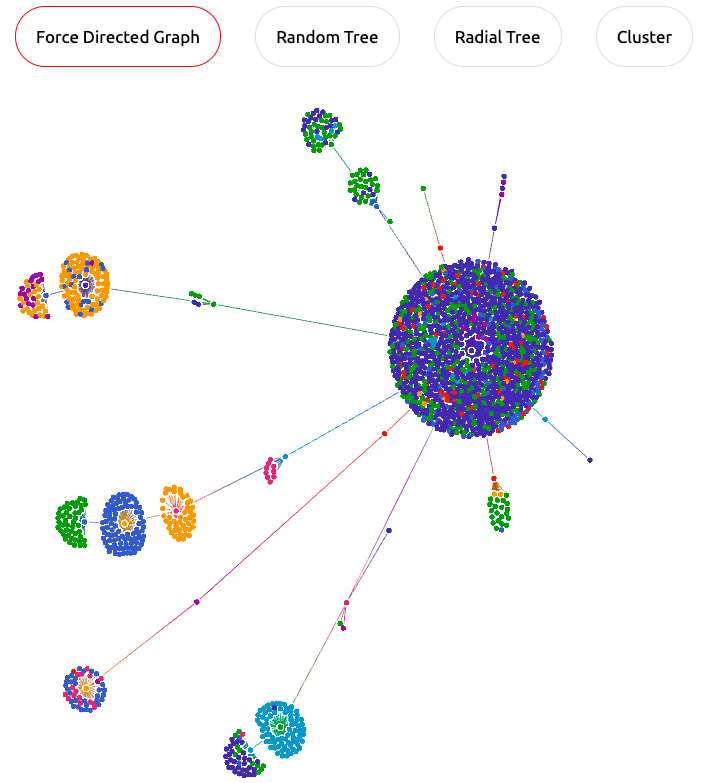
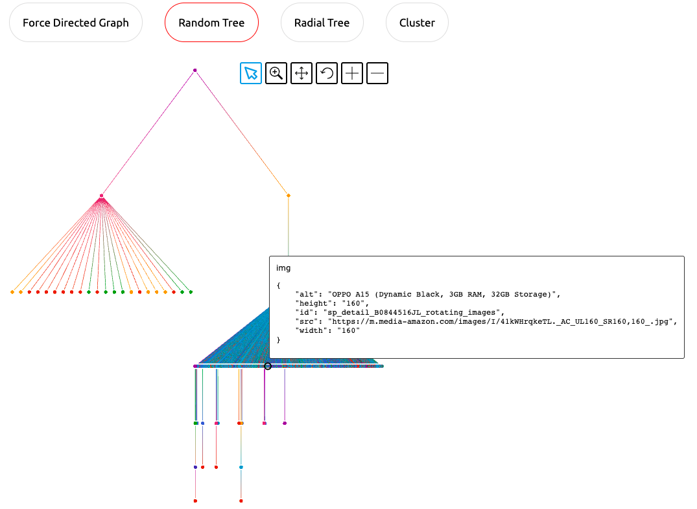
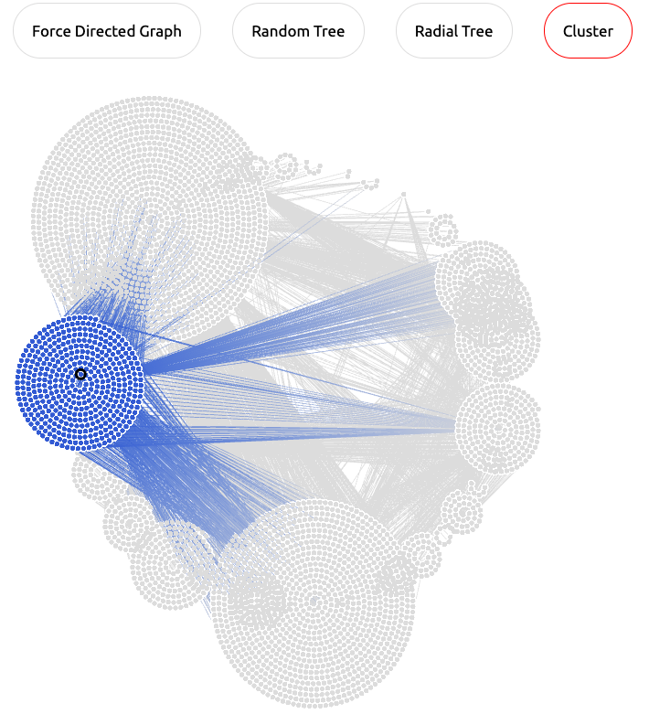
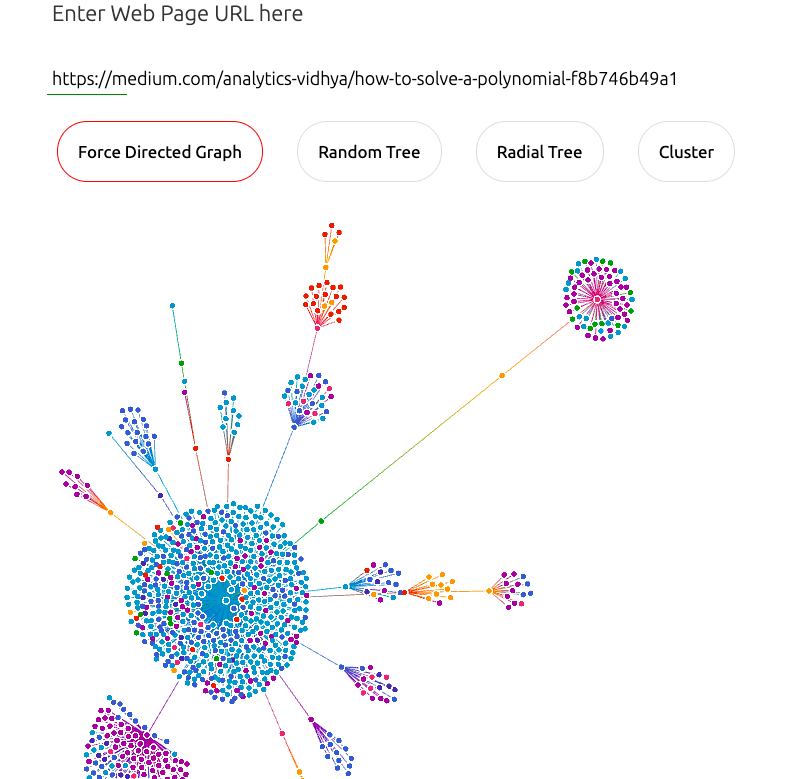
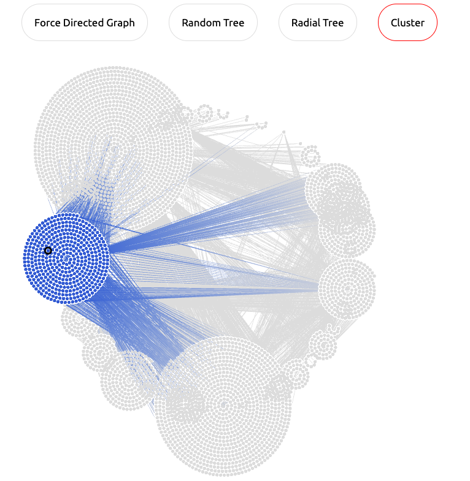
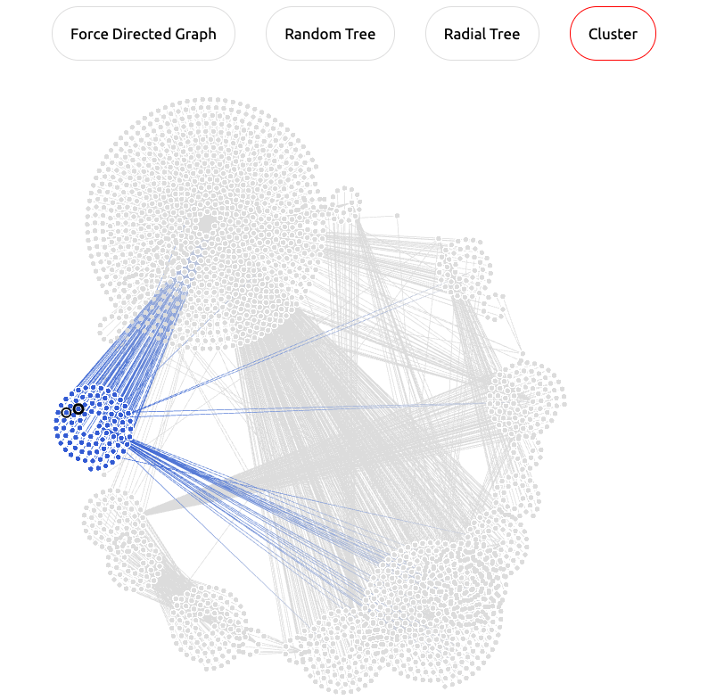

# webG: Graph Visualization of Web

Web pages are graphs and they should be treated as graphs. 

webG allows you to visualize the DOM tree of any web page as a graph. We currently provide 4 types of visualizations.

- Force Directed
- Random Tree
- Radial Tree
- Cluster

Given a URL of a web page, webG's python backend scrapes the page, converts the DOM tree into a `networkx` graph and  passes it as a JSON string to the frontend for rendering, using El Grapho.

See my blog for details: [webG: Visualization of DOM Tree](https://vrevathi.medium.com/webg-visualization-of-dom-tree-96f15bc81aa2)

## Features

- Graph visualization of web page



- Metadata from DOM elements



- Filtering nodes into groups



## Setup

```bash
git clone https://github.com/reyscode/webG
cd webG/
pip install -r requirements.txt
```

## Usage

```bash
python3 app.py

```

```console
 * Serving Flask app "app" (lazy loading)
 * Environment: production
   WARNING: This is a development server. Do not use it in a production deployment.
   Use a production WSGI server instead.
 * Debug mode: on
 * Running on http://127.0.0.1:5000/ (Press CTRL+C to quit)
 * Restarting with stat
 * Debugger is active!
 * Debugger PIN: 220-921-536
```





## Who should use it?

This tool would be useful to anyone working on web page analysis, scraping, Machine Learning, etc. Visualizing web pages as graphs offers intuitions about the organization of DOM elements. These intuitions could be built into a predictive model as features or they could lead to larger, powerful and impactful ideas. For example, comparing the Amazon and Flipkart's cluster graphs, we arrive at the idea that Amazon advertises more (other) products in a product page compared to Flipkart.

|         Amazon         |         Flipkart         |
| :--------------------: | :----------------------: |
|  |  |

## Tools Used

1. Flask: to build a web application
2. Elgrapho: Interative visualization
3. Typora for editing markdown


## How to contribute

You can contribute to this project in the following ways:

1. Each kind of graph offers a unique perspective on the webpage. You could contribute by adding more kinds of visualization. 
2. Currently the size of nodes are set globally. Adjusting the node size dynamically depending on a feature of the node (number of incoming edges) could be a nice feature to have.
3. Since visualizing a website as graph is new idea, I am yet to figure out its applications beyond Data Analysis. Feel free to contact me if you have any interesting applications.


