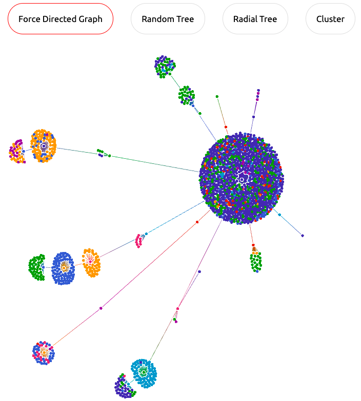

# webG: Graph Visualization of Web

With the advent of powerful machine learning algorithms, more and more of our applications are becoming data-driven. The largest source of information humankind has managed to accumulate is the internet. When we think of internet as a source of useful data, we think of scraping text, images and other valuable information from web pages. The acquired data would be wrangled, cleaned and transformed into a format suitable for further analysis and predictive modeling. A big chunk of the feature engineering process had been made obsolete by Deep Learning.

The internet is full of structured data. When we scrape the web we try to get rid of this structural information. Imagine using this information as part of Data Analysis. Let's be a little bit bolder and imagine building a predictive model that can directly train on structured content on web pages. An ambitious idea indeed.

A web page consists of text content distributed spatially in such a way that keeps the reader focussed. Another way to look at a page is by inspecting it with developer tools. It shows the elements in a web page as a tree. We call this the DOM (Document Object Model) tree. In this article, I'll showcase a tool I built for visualizing DOM tree of web pages - webG. I will do a step-by-step walkthrough of the project's development process.

Now why would you want to visualize the DOM tree? Isn't that supposed to be hidden from the user?

>  A change in perspective is worth 80 IQ points.

Visualization of DOM trees as graphs reveals not-so-obvious, interesting and potentially useful information about the web page. webG offers you a new set of lens to look at the internet. Do with it what you will!

## What is a graph? 

A graph is a diagrammatical illustration of a set of data. It is a non-linear data structure consisting of nodes and edges. The nodes are sometimes also referred to as vertices, and the edges are lines or arcs that connect any two nodes in the graph. A simple graph structure is given below:


## NetworkX


We have a python package called *NetworkX* for creation, manipulation, and study of the structure, dynamics, and functions of complex networks. NetworkX provides an easy-to-use framework for handing small to medium scale graphs.

We can generate graphs using few lines of codes. Find below a simple graph generated using *NetworkX*

```bash
import networkx as nx
import pylab as plt #import Matplotlib plotting interface
g = nx.watts_strogatz_graph(100, 8, 0.1)
nx.draw(g)
nx.draw_spectral(g)
nx.draw_circular(g)
nx.draw_random(g)
plt.savefig('graph.png')
```

 

NetworkX is a powerful tool for working with networks. But it didn't suit the needs of this project, for the following reasons:

- When the graph size is too big for example, the graph has 10k nodes, it takes a lot of time for rendering the graph.

- Rendering output is of low quality and

- Static hence we cannot interact with it

## What is webG?

We do not have any tools for visualizing web page as a graph because it is relatively new idea. webG allows you to visualize the DOM tree of any web page as a graph. It currently supports 4 types of graph visualizations.

- Force Directed
- Random Tree
- Radial Tree
- Cluster

Given a URL of a web page, webG's python backend scrapes the page, converts the DOM tree into a `networkx` graph and  passes it as a JSON string to the frontend for rendering, using El Grapho.

## Features

A quick walkthrough of webG's features.

- Visualizes web pages as graphs



- Displays metadata from DOM elements


- Supports grouping of nodes


# Why Flask?


We have used *Flask*,  python web framework for quickly building web applications. Before looking into the details, let me explain why we've used flask. Why didn't we build a simple javascript-based web page that runs on the client's browser?

Browser security prevents a web page from making requests to a different domain. This restriction is called the *same-origin policy*. The same-origin policy prevents the site from reading sensitive data from another site. So, it is (almost) impossible to build a web page that scrapes other websites while running on the client's browswer. To overcome this restriction, we chose to build a web app using Flask. Cross-origin resource sharing (**CORS**) is a mechanism that allows restricted resources on a web page to be requested from another domain outside the domain. A Flask extension for handling Cross Origin Resource Sharing (CORS) exists, making cross-origin AJAX possible.

## Hello Flask!

Let's first see a simple "Hello World" application using Flask.

```bash
from flask import Flask

# Create an app object, which is an instance of flask object.
app = Flask(__name__)

@app.route('/')
def hello():
    """ Displays the home page accessible at '/'
    """
    return "<h1>Hello World!</h1>"

if __name__ == '__main__':
    app.run(debug=True)
```

In the example above, when the app is running and accessed at http://127.0.0.1:5000/ the user will get `"Hello World!"` as a response.


Dynamic web applications need static resources (CSS and JavaScript files) for programming their dynamic behaviour. Just create a folder called `static` in your package and it will be available at `/static` in the application.

To generate URLs for static files, use the special `'static'` endpoint name:

```
url_for('static', filename='style.css')
```

The file has to be stored on the filesystem as `static/style.css`.

To render a template we have to use the`render_template()` method:

```bash
from flask import render_template

@app.route('/hello/')
@app.route('/hello/<name>')
def hello(name=None):
    return render_template('hello.html')
```

The code above renders the file `hello.html` placed under the `templates/` folder.

## el glorioso grapho


So, how does webG render the graph in the browser? Say hola to El Grapho, a powerful javascript library for visualizing large graphs. Why did we choose El Grapho? El Graph is scalable - supports millions of interactive nodes and edges, high-performing and easy-to-use.

### A note on my development environment

Initially I used codepen.io for working on the project. It is simple and easy to use. It has a window pane for javascript, one for css, and one for html. It has an output pane that renders the html. It also has a console which helps with debugging. Codepen is great for quickly prototyping tiny project ideas. But for building a complete project we need to deal with more than one javascript, html and css files. As the project idea naturally evloved into something bigger and bigger, I had to switch to VSCode, a full-fledged IDE for project development.

## Program Flow

We've covered all the basics. Let's take a look at how to code works.

Everything starts here. We have a text box for entering an URL. When we enter the url and submit, the aptly named callback function `button_callback()` in graph.js is triggered.

```bash
function button_callback(){
    let url = document.getElementById("url_p");
    console.log('Button callback!!')
    if (isValidUrl(url.value)){
        
        console.log('Before AJAX!');
        $.ajax({
            url: "/json",
            type: "get",
            data: {jsdata: url.value},
            success: function(response) {
                gData = null;
                manipulateData(response);
            },
            error: function(xhr) {
                console.log('Error happened in AJAX call!');
            }
        });
    }
    else{
        console.log(url.value + " is not valid!");
    }    
}  
```

The ajax call in the `button_callback()` function issues a GET request to [localhost:5000/json](). Flask responds to the GET request by calling the `get_json()` method. Notice the decorator on top of the function `app.route('/json', methods=['GET'])`, which is a special flask construct that redirects the HTTP request to `/json` to the `get_json()` function. 

```bash
@app.route('/json', methods=['GET'])
@cross_origin(origin='localhost',headers=['Content- Type','Authorization'])
def get_json():
    url = request.args.get('jsdata')
    return w2json(url)
```

Moving on to the internals of the python part of the code. We've a GET request from the client containing an URL as a parameter. We are supposed to respond with the DOM graph of the URL. `webg.py` handles this part.  `get_json()` calls `w2json()` method of *webg.py*.

```bash
def w2json(url):
  """fetch DOM elements from a URL and return a networkx graph as JSON"""
  # create an empty graph
  wg = nx.Graph()
  # get response from url
  response = requests.get(url, headers=HEADERS)
  # get soup
  soup = BeautifulSoup(response.content, "lxml")
  # remove garbage
  for script in soup.select('script'):
    script.extract()
  # create an empty node dictionary
  node_dict = {}
  # traverse through soup -> get graph
  _traverse_html(soup, wg, defaultdict(int), _node_dict=node_dict)
  return g2json(wg, node_dict)
```

`w2json()` method traverses the DOM elements in the HTML soup of the given url and creates a networkx graph, which is passed on to `g2json()` to convert it into JSON format. The JSON string is finally returned back. 

```bash
def _traverse_html(_d, _graph, _counter, _parent=None, _node_dict=None):
  """Traverse the DOM elements in a HTML soup and create a networkx graph"""
  for i in _d.contents:
     if i.name is not None:
       try:
         _name_count = _counter.get(i.name)
         if _parent is not None:
           _graph.add_node(_parent)
           _c_name = i.name if not _name_count else f'{i.name}_{_name_count}'
           _graph.add_edge(_parent, _c_name)
           _node_dict[_c_name] = i
         _counter[i.name] += 1
         _traverse_html(i, _graph, _counter, i.name, _node_dict=_node_dict)
       except AttributeError:
         pass
```

The Flask server responds to the client with a DOM graph in JSON format. 

Why JSON format? JSON (Javascript Object Notation) is the universally accepted text format for transferring a data between a browser and a server. JSON is human readable, easy to convert to javascript object and javascript objects are easy to conver into JSON without complicated parsing.

```python
def g2json(g, node_dict):
  """Convert a networkx graph to JSON format"""
  # make unique tags
  tags = [ parse_tag(key) for key in list(node_dict.keys()) ]
  tag_id = { tag: i for i, tag in enumerate(sorted(set(tags))) }
  # include html tag
  tag_id.update({'html' : len(tag_id) })
  json_g = json_graph.node_link_data(g)
  for i, node in enumerate(json_g['nodes']):
    json_g['nodes'][i]['label'] = tag_id[parse_tag(node['id'])]
    if node['id'] in node_dict:
      json_g['nodes'][i]['attrs'] = node_dict[node['id']].attrs
    else:
      json_g['nodes'][i]['attrs'] = {}
  return json_g
```

Now the client has the data that should be rendered as a graph on to the empty container in the broswer page. The graph data is manipulated and transformed to a format compatible with *El grapho* using `manipulateData()`.

```javascript
function manipulateData(data){

    if (data == null){
        return;
    }

    // create node dictionary
    let ndict = {};
    data.nodes.forEach(function(node, index){
        ndict[node.id] = index;
    });

    // Make links
    let links = data.links.map(function(link){
        src = ndict[link.source];
        target = ndict[link.target];
        return {"source" : src, "target" : target}
    });

    let model = {
        nodes: [],
        edges: []
    };

    data.nodes.forEach(function(node, n) {
        model.nodes.push({
        group: ( ('label' in node) ? node.label : 1),
        label: ( (setNodeId) ? node.id : null )
        });

    });

    links.forEach(function(link) {
        let fromIndex = link.source;
        let toIndex = link.target;

        model.edges.push({
        from: fromIndex,
        to: toIndex
        });
    });
	
	// ...
    
}
```

The Model is stored globally. `render_graph()` renders it as an *El Grapho* graph.

```javascript
function render_graph(layout){
    if (gModel == null){
        console.log('No model exists!')
        return;
    }

    G = new ElGrapho({
        container: gContainer,
        model: layout(gModel),
        width: gWidth,
        height: gHeight,
        nodeSize: nodeSize,
        debug: gDebug
      });
    // set tooltip function
    G.tooltipTemplate = toolTipFn;
    // scroll to page bottom
    window.scrollTo(0,document.body.scrollHeight);
}

```

 `toolTipFn()`  is a callback function that is triggered when the user places the cursor on a node. The function below renders the metadata of a selected node in a small pop-out window.

```bash
function toolTipFn(index, el) {
    // get node type from id
    let node_id = gData.nodes[index].id;
    let i = node_id.indexOf("_");
    if (i > -1){
        node_id = node_id.substring(0, i);
    }
    el.innerHTML = node_id + "<br />" + "<pre>" + JSON.stringify(gData.nodes[index].attrs, null, 4) + "</pre>";
};
```

## applications

This tool would be useful to anyone working on Web Page Analysis, Web Scraping, Machine Learning, etc. Visualizing web pages as graphs offers intuitions about the organization of DOM elements. These intuitions could be built into a predictive model as features or they could lead to larger, powerful and impactful ideas. It is essential to observe that by representing a webpage as a graph we are losing any kind of spatial information like position of DOM elements in the browser. The position and size of DOM elements are crucial features that shouldn't be neglected while building a predictive model.

## Case Studies

### Amazon vs Flipkart

Comparing the Amazon and Flipkart's cluster graphs, we arrive at the idea that Amazon advertises more (other) products in a product page compared to Flipkart.

|                            Amazon                            |                           Flipkart                           |
| :----------------------------------------------------------: | :----------------------------------------------------------: |
|  |  |


###  E-commerce vs Wikipedia

Below are the cluster graphs of two different products of Amazon followed by graphs of two different pages of wikipedia. Comparing the graphs of amazon and wikipedia, we can observe that amazon advertises more or less the same amount of other products on the product page and hence the graphs are almost similar. But in wikipedia, the graph size changes for every article depending on the significance of the subject of the article.

|                       Amazon Product 1                       |                       Amazon Product 2                       |
| :----------------------------------------------------------: | :----------------------------------------------------------: |
|  |  |


|                     Wikipedia:Tamil                      |                     Wikipedia:Idli                      |
| :------------------------------------------------------: | :-----------------------------------------------------: |
|  |  |

As an exercise, try using webG to point out differences in UI design between gitlab and github.

## How to contribute

There is so much more to do here. You can contribute to this project in the following ways:

1. Each kind of graph offers a unique perspective on the webpage. You could contribute by adding more kinds of visualization. 
2. Currently the size of the nodes are set globally. Adjusting the node size dynamically depending on a feature of the node (number of incoming edges) could be a nice feature to have.
3. Add and compare multiple web pages
4. Render difference between graphs. See [graphtage](https://github.com/trailofbits/graphtage)
5. Render any graph data from JSON file, not just web pages
6. Render directional graphs
7. Download graph as png/svg
8. Render images and hyperlinks in tooltip container
9. Since visualizing a website as graph is a relatively new idea, I am yet to figure out its applications beyond Data Analysis. Feel free to contact me if you have any interesting ideas.


